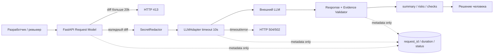

# ADR: контролируемый pipeline AI-ревью

- Статус: proposed
- Дата: 2026-09-09
- Ответственные: владелец backend-сервиса и человек-ревьюер

## Контекст

Учебный diff добавляет прямой путь `HTTP payload → ReviewService → внешний LLM → comment`. Правила кейса требуют ограничить вход, удалить секреты до внешнего вызова, ограничить вызов 10 секундами, вернуть строгую схему, доказать каждый риск и не логировать содержимое. Эти требования пересекают несколько слоёв и не должны зависеть только от текста prompt.

## Решение

Использовать последовательный контролируемый pipeline:

1. FastAPI-модели валидируют наличие и строковый тип `diff`; отдельная проверка отклоняет длину >20 000 с HTTP 413.
2. Детерминированный `SecretRedactor` очищает diff до передачи за границу сервиса.
3. `LLMAdapter` применяет timeout 10 секунд и переводит timeout/ошибку в доменную контролируемую ошибку. Для timeout предлагается HTTP 504, для прочей ошибки зависимости — HTTP 502; это локальное архитектурное решение, поскольку `REL-1` не задаёт коды.
4. LLM получает очищенный diff и контракт `OUT-1`/`QA-1`, но его ответ считается недоверенным.
5. `ReviewResponseValidator` проверяет схему, максимум три риска и evidence против diff/правил.
6. API возвращает структурированный ответ, а логгер принимает только `request_id`, duration и status.
7. Никакой компонент pipeline не получает полномочий писать код или выполнять GitHub-действия.

## Рассмотренные альтернативы

| Альтернатива | Почему не выбрали сейчас |
|---|---|
| Все ограничения только в prompt | Prompt не гарантирует HTTP 413, timeout, redaction и безопасное логирование; эти свойства должны проверяться кодом. |
| Отправлять исходный diff во внутреннюю модель | Не решает учебное требование `SEC-1` и привязывает дизайн к неизвестной инфраструктуре. |
| Возвращать свободный `comment` и проверять вручную | Не выполняет `OUT-1`, затрудняет автоматическую проверку и повышает нагрузку на ревьюера. |
| Автоматически публиковать комментарии или approve PR | Прямо нарушает `SCOPE-1`; решение должен принимать человек. |

## Последствия и главный риск

- Положительные последствия: правила становятся тестируемыми; внешний LLM изолирован; результат имеет стабильный контракт; ошибки наблюдаемы без утечки содержимого.
- Ограничения: pipeline сложнее прямого вызова; redaction может давать false positive/false negative; schema не гарантирует смысловую корректность.
- Главный риск: секрет в неизвестном формате не будет распознан и попадёт во внешний LLM.
- Как проверим риск: расширяемые фикстуры токенов/ключей, LLM-spy, негативные тесты и регулярный ручной security-review паттернов.

## Архитектурная схема

## Как использовали AI

- Для чего: сопоставить правила с компонентами и рассмотреть альтернативы.
- Тип промпта: homework master prompt.
- Строка в [`prompts.md`](prompts.md): `P1-03`.
- Что проверили и исправили сами: отделили обязательные правила от выбранных кодов 502/504 и обозначили ADR как proposed.
