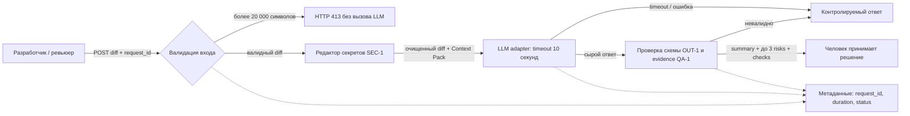

# Анализ процесса: AS IS и TO BE

## AS IS

1. Разработчик отправляет JSON в `POST /api/reviews`.
2. Endpoint получает произвольный `dict` и читает `payload["diff"]`.
3. `ReviewService` без показанной предобработки вставляет diff в текст prompt.
4. Внешний LLM вызывается без видимого в diff timeout и локального преобразования ошибки.
5. Непроверенный ответ возвращается как `{"comment": answer}`.
6. Человек получает свободный текст, в котором доказательства и проверки не обязательны.

Точки потери контроля: граница входа, передача секретов наружу, зависимость от LLM, неструктурированный результат и неизвестное логирование.

## TO BE

Выбрана DFD-подобная схема: она показывает движение чувствительных данных и места применения правил.

## Разница

| Что меняется | AS IS | TO BE | Как проверим изменение |
|---|---|---|---|
| Вход | Произвольный `dict`, лимит не показан. | Типизированный `diff: str`, граница 20 000, превышение → 413 до LLM. | Boundary tests 19 999 / 20 000 / 20 001 и LLM-spy. |
| Конфиденциальность | Исходный diff включается в prompt. | Секреты заменяются до внешнего вызова. | Набор тестовых секретов не встречается во входе LLM-spy. |
| Надёжность | Timeout и обработка ошибки не показаны. | Adapter ограничивает вызов 10 секундами и возвращает контролируемую ошибку. | Stub с задержкой >10 секунд и stub с исключением. |
| Результат | Свободное поле `comment`. | Схема `summary`, `risks`, `checks`; максимум 3 риска с evidence. | Валидация schema и проверка каждого риска против diff/правила. |
| Границы AI | Из сигнатуры не видно ограничений действий. | Только рекомендации; решение принимает человек. | Контракт не содержит команд записи/approve/merge. |
| Наблюдаемость | В diff не показана. | Только `request_id`, duration, status. | Capture логов на успехе и ошибке. |

## Как использовали AI

- Для чего: описать поток данных и найти контрольные точки между компонентами.
- Тип промпта: homework master prompt.
- Строка в [`prompts.md`](prompts.md): `P1-03`.
- Что проверили и исправили сами: AS IS ограничили видимыми строками diff, а TO BE явно обозначили как проектируемый процесс.
