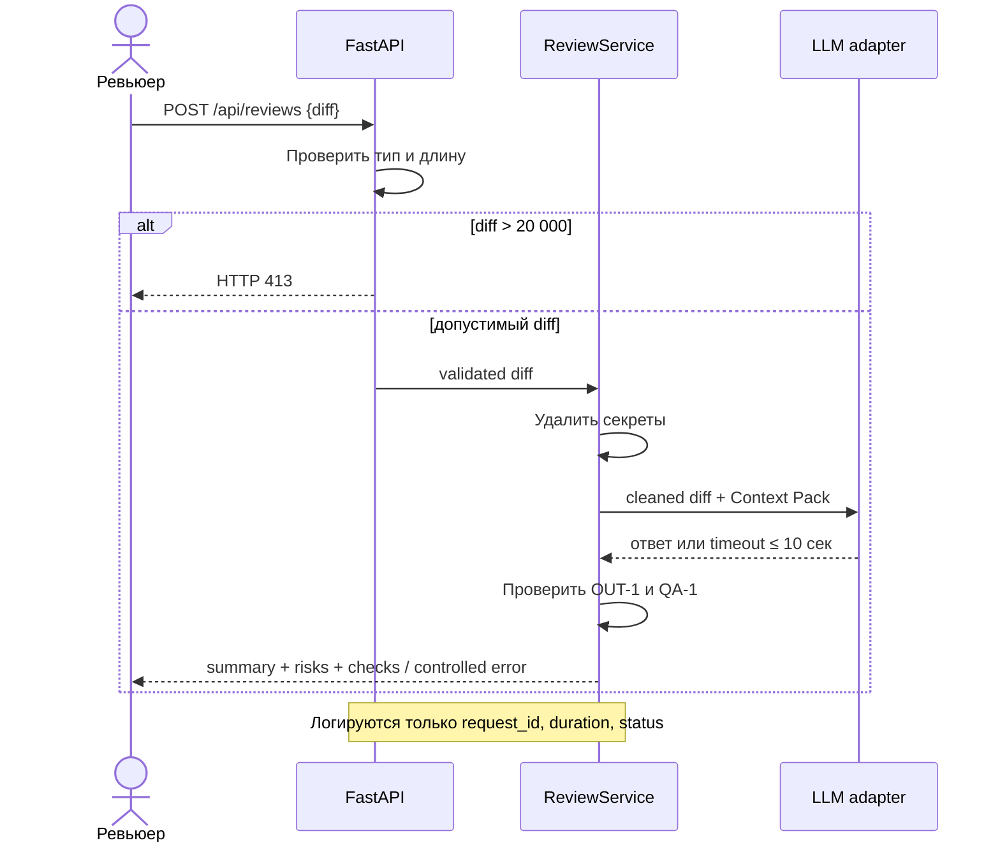

# Use cases и user stories

## Первый рабочий сценарий

**Когда** ревьюер отправляет допустимый diff, **система** очищает его от секретов, получает и валидирует рекомендацию LLM, **а пользователь получает** краткое summary, до трёх доказанных рисков и воспроизводимые checks.

Не входит в сценарий:

- изменение кода или содержимого PR;
- approve, merge и публикация комментариев в GitHub;
- чтение репозитория за пределами переданного diff;
- ранжирование разработчиков или другие кадровые решения.

## Use case

| Поле | Значение |
|---|---|
| Актор | Разработчик или человек-ревьюер PR. |
| Триггер | `POST /api/reviews` с JSON-полем `diff`. |
| Предусловия | `diff` — строка длиной не более 20 000 символов; сервис и LLM adapter доступны. |
| Основной результат | Структурированный advisory-ответ `summary`, `risks`, `checks`, соответствующий `OUT-1`/`QA-1`. |
| Ошибка или отказ | 20 001+ символов → HTTP 413 без LLM; timeout/ошибка/невалидный ответ LLM → контролируемый ответ без утечки содержимого в лог. |



## User stories и acceptance criteria

### US-1. Доказательное ревью

Как ревьюер, я хочу получить компактный структурированный ответ, чтобы быстро проверить не более трёх главных рисков и принять решение самостоятельно.

### US-2. Безопасная отправка во внешний LLM

Как владелец сервиса, я хочу удалять секреты из diff до внешнего вызова, чтобы конфиденциальные данные не покидали доверенный контур.

### US-3. Предсказуемый отказ

Как API-клиент, я хочу получить контролируемый ответ на слишком большой diff или сбой LLM, чтобы автоматизация не зависала и могла обработать ошибку.

### US-4. Безопасная наблюдаемость

Как инженер эксплуатации, я хочу видеть request_id, длительность и статус без содержимого diff/ответа, чтобы диагностировать сервис без утечки данных.

```gherkin
Feature: Безопасное advisory-ревью pull request

  Scenario: Валидный diff возвращает доказательный результат
    Given diff длиной не более 20000 символов без секретов
    And LLM возвращает ответ по схеме OUT-1
    When ревьюер вызывает POST /api/reviews
    Then ответ содержит summary, risks и checks
    And risks содержит не более трех элементов
    And каждый риск имеет file, line, evidence и risk

  Scenario: Секрет редактируется до внешнего вызова
    Given diff содержит тестовый токен
    When сервис вызывает внешний LLM
    Then LLM получает [REDACTED] вместо токена
    And исходный токен отсутствует в логах и ответе

  Scenario: Слишком большой diff отклоняется
    Given diff длиной 20001 символ
    When ревьюер вызывает POST /api/reviews
    Then сервис возвращает HTTP 413
    And LLM не вызывается

  Scenario: LLM превышает timeout
    Given LLM не отвечает дольше 10 секунд
    When ревьюер вызывает POST /api/reviews
    Then вызов LLM прекращается не позже 10 секунд
    And клиент получает контролируемую ошибку

  Scenario: Недоказанный риск исключается
    Given LLM вернул риск без строки diff или правила
    When сервис проверяет ответ
    Then недоказанный риск не попадает в итоговый risks
```

## Как использовали AI

- Для чего: связать пользовательскую ценность с правилами и acceptance criteria.
- Тип промпта: homework master prompt.
- Строка в [`prompts.md`](prompts.md): `P1-03`.
- Что проверили и исправили сами: оставили решение за человеком и не добавили GitHub-действия, запрещённые `SCOPE-1`.
