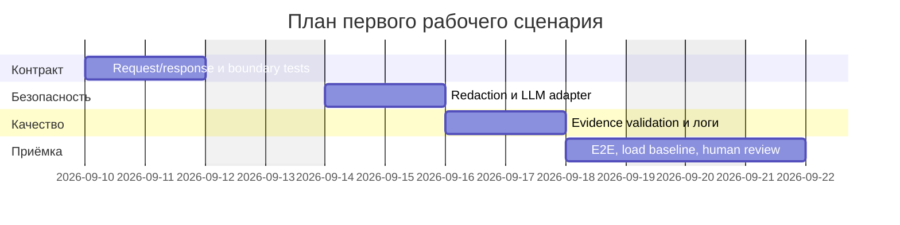

# План поставки

## Инкременты и ответственность

| Инкремент | Наблюдаемый результат | Что делает человек | Что делает AI или субагент | Проверка | Зависимости |
|---|---|---|---|---|---|
| 1. Контракт и вход | Типизированный request/response; >20 000 → 413 без LLM. | Утверждает HTTP-контракт и ревьюит boundary cases. | Предлагает модели и тестовые сценарии, не меняет внешние системы. | Unit + integration: 19 999/20 000/20 001, schema `OUT-1`. | `API-1`, `OUT-1`. |
| 2. Безопасный LLM-вызов | Секреты редактируются; timeout 10 сек; ошибки контролируемы. | Выбирает категории секретов и код ошибки, проверяет реализацию. | Генерирует варианты redaction/adapter и негативные тесты. | LLM-spy не видит секрет; timeout/error stubs завершаются контролируемо. | Инкремент 1, `SEC-1`, `REL-1`. |
| 3. Качество и наблюдаемость | До трёх доказанных рисков; безопасные логи; E2E и load baseline. | Проводит code review, принимает остаточные риски и решение о выпуске. | Проверяет schema/evidence, предлагает матрицу тестов и отчёт. | `QA-1`, `OBS-1`, E2E happy/error/boundary, нагрузочный baseline. | Инкременты 1–2. |

AI отвечает за предложения и черновики. Человек утверждает требования, принимает архитектурные компромиссы, проверяет evidence и единолично решает вопрос выпуска/merge.

## Диаграмма Ганта

## Риски поставки

| Риск | Снижение риска | Владелец |
|---|---|---|
| Redaction не распознает новый формат секрета. | Версионируемый набор паттернов, тестовые фикстуры и ручная проверка ложных срабатываний. | Человек — security owner. |
| LLM возвращает синтаксически валидный, но недоказанный риск. | Детерминированная проверка `file`, `line`, `evidence` против diff/правил; иначе риск отбрасывается. | Backend owner. |
| Реальная latency выше предварительного SLO. | Снять baseline на stub и staging, после чего утвердить SLO и лимит конкуренции. | Platform owner. |

## Как использовали AI

- Для чего: декомпозировать решение на проверяемые инкременты и разделить ответственность человека и AI.
- Тип промпта: homework master prompt.
- Строка в [`prompts.md`](prompts.md): `P1-03`.
- Что проверили и исправили сами: даты и роли представлены как план, а не как уже выполненная работа; финальное решение закреплено за человеком.
